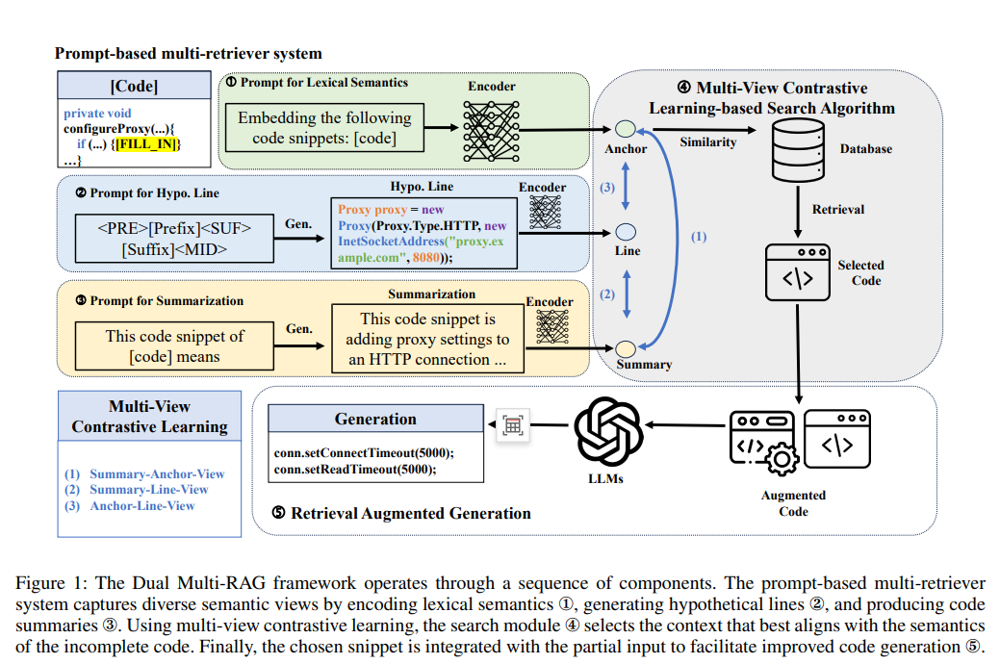

## This is the official repository for Dual Multi-RAG: Multi-View Contrastive Learning for Code Completion

Recent advancements in pre-trained Large Language Models (LLMs) have notably improved automated code completion, which involves predicting the next tokens in partially written code. Nonetheless, these models still face challenges such as logical inconsistencies and hallucinated outputs, particularly when managing intricate code structures or extending beyond learned patterns. Retrieval-Augmented Generation (RAG) approaches offer a partial remedy by incorporating relevant code snippets retrieved via a separate encoder, using them as contextual aids during completion. Yet, the retrieval process is often constrained by the fixed viewpoint of the encoder, limiting its ability to capture the nuanced and multifaceted nature of code semantics.

To mitigate this limitation, we introduce Dual Multi-RAG, a novel framework for code completion that utilizes prompt engineering in conjunction with multi-view contrastive learning to integrate diverse code understanding perspectives. Initially, Dual Multi-RAG applies a prompt-driven multi-retrieval strategy, where custom-designed prompt templates guide LLMs to capture code semantics from various angles. Subsequently, it leverages a contrastive learning-based search mechanism to identify the most contextually relevant code snippet for completion. By incorporating multiple analytical perspectives in both retrieval and selection stages, the framework earns its name “Dual Multi-RAG.” Experimental evaluations reveal that Dual Multi-RAG achieves superior performance, surpassing the advanced ProCC approach by 3.91\% on the CCEval benchmark and by 9.26% on HumanEval-Infilling.


<p align="center">

</p>


### Evalution
For the cceval benchmark, use the following script to build the environment:
```
git clone https://github.com/amazon-science/cceval.git ./benchmark/cceval
cd ./benchmark/cceval
pip install -r requirements.txt
pip install tree-sitter==0.21.3  # fix tree-sitter version incompatibility issues.
bash scripts/build_treesitter.sh
```
Then use of official inference and evaluation scripts, please refer to [cceval](https://github.com/amazon-science/cceval).
```
cd path_to_dual_multi_RAG
# for inference
python benchmark/cceval/scripts/vllm_inference.py \
    --data_root_dir ./benchmark/cceval_data \
    --tp_size 8 \
    --task line_completion_bm25 \
    --language java \
    --model path/deepseek-coder-1.3b-instruct \
    --output_dir ./tmp \
    --model_max_tokens 16384 \
    --use_crossfile_context \
    --crossfile_max_tokens 12800

# for evaluation
python benchmark/cceval/scripts/eval.py \
    --prompt_file ./benchmark/cceval_data/java/line_completion_bm25.jsonl \
    --output_dir ./tmp \
    --ts_lib ./benchmark/cceval/build/java-lang-parser.so \
    --language java \
    --only_compute_metric
```
